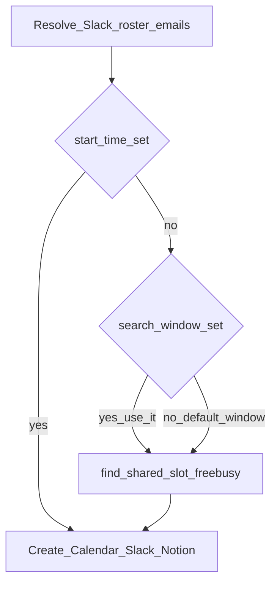

# Plan: Time resolution (exact vs free/busy) + real Slack channels

Status: **not implemented**. Current code still requires `start_time`, maps Engineering → `#engineering` (other slugs are old), and stamps Calendar `timeZone: UTC`. Use this file after you finish testing what works today.

## How time is chosen

Slack roster first (channel members or named handles). Then:

| Prompt | Model emits | Server |
|---|---|---|
| Exact time (“3pm”, “in 15 minutes”) | `start_time` ISO with offset | `end = start + duration`; skip free/busy |
| Range (“find a time between 2 and 4”) | `preferred_start` + `preferred_end`, omit `start_time` | Free/busy on roster emails; first slot of `duration_minutes` in that window |
| No time (“schedule with alex and sam”) | omit `start_time` and window | Same free/busy inside a **default** window: rest of today through next N business hours in `SCHEDULER_TIMEZONE` (default `America/New_York`, N configurable e.g. 3 days / 9–17 local) |

Ad-hoc and department use the **same** free/busy path; only the email list differs (named people vs channel members).

Reuse `logic/calendar_logic.py` `find_shared_slot` from `logic/meeting_orchestrator.py` **after** emails exist. Remove mock_freebusy fallback — if Google errors or no slot fits, fail with a clear error. Do not invent a time.

**MCP** (`mcp_server.py`): `start_time` no longer required. Descriptions: exact time → `start_time`; range → `preferred_start`/`preferred_end` only; no time → omit all three and let the server default the search window. Never invent a clock time when the user did not give one.

**Display / timezone**

Calendar today stamps `"timeZone": "UTC"` which fights an offset in `dateTime`. Send offset-aware `dateTime` only. Slack reminder includes start–end. Notion `Date & Time` start/end unchanged.

**Scale caveat:** free/busy only sees calendars the OAuth Google user can read (typically same Workspace). Slack emails on personal Gmail may return empty busy arrays (looks “free”). Document that; do not fake busy data.

## Slack channels (from your workspace)

| Department enum | Slack slug |
|---|---|
| Engineering | `engineering` |
| Product | `product` |
| Cloud | `cloud` |
| Data Science | `data-science` |
| Security | `security` |

All five are **public**. Update `DEPT_CHANNEL_SLUGS`, aliases, MCP enum, Notion setup select options, README. Keep `conversations.list` on `public_channel`. The bot still must be **in** each channel or `conversations.members` returns `channel_not_found`.

Omitted department in department mode: error. Ad-hoc without department: Notion tag `Ad-hoc`.

## Implementation todos (when you are ready)

1. Three-way time: exact `start_time` OR search window OR default window; free/busy on Slack-roster emails; timezone-aware Calendar/Slack/Notion.
2. Remap departments to public `engineering` / `product` / `cloud` / `data-science` / `security`.
3. MCP schema/descriptions (optional `start_time`, `preferred_start`/`preferred_end`), aliases, Notion options, README.
